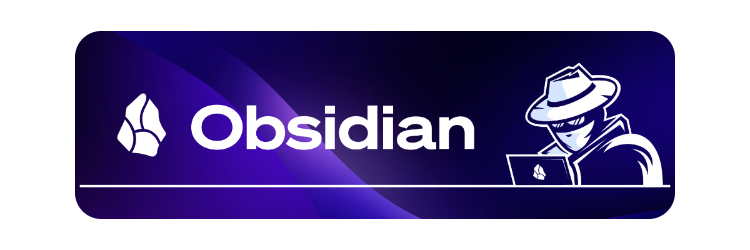
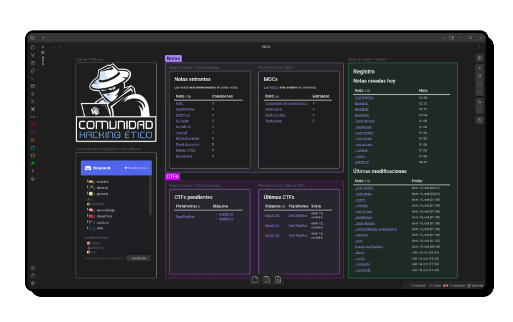

    
    
    
    
    

# Plantilla de bóveda de Obsidian

Este repositorio contiene una bóveda de [Obsidian][obsidian] que se puede usar como plantilla para crear una bóveda personal.

## Características

La bóveda se ha enfocado en el contexto de la ciberseguridad, tomando en cuenta los casos de uso habituales para toma de notas:

- _**Writeups**_: documentación de retos CTF, tanto para resolverlos como para compartirlos.
- **Código**: documentación de código, tanto en su desarrollo, como en su toma de decisisones y su resolución frente a obstáculos.
- **Certificaciones**: preparación y contenido de certificaciones de ciberseguridad.
- **Conceptos**: definiciones y explicaciones sobre términos de ciberseguridad.
- **Contenido**: notas para gestionar la creación de contenido.
- **Diario**: remarcar eventos importantes y enlazarlos con otras notas.
- **MOCs**: mapas de conceptos para enlazar notas entre sí.
- **Personas**: trayectoria profesional, proyectos y logros de personas de interés.

> [!NOTE]
> Visita la nota [Tutorial](/Com.%20Hacking%20Ético/Tutorial.md) para entender el funcionamiento y las razones de la configuración.

## ¿Qué es Obsidian?

Se trata de una aplicación de **gestión de notas** que se caracteriza principalmente por ser: simple, ligera, flexible y extensible.

Esta aplicación renderiza ficheros [Markdown][MD] y añade otras funcionalidades propias, como enlazado y etiquetado de notas, visualización de conexiones entre notas... y pudiendo añadir aún más funcionalidades adicionales mediante [plugins](https://obsidian.md/plugins).

### ¿Qué es una bóveda?

Una bóveda de [Obsidian][MD] es una carpeta que almacena las notas que usará [Obsidian][MD] y también su configuración.

**Las notas de la bóveda**  
Conjunto de ficheros [Markdown][MD] y ficheros multimedia (imágenes, vídeos, audios...).

**La carpeta de configuración (`.obsidian/`)**  
Gestiona los plugins, los temas, los workspaces... y el estado más reciente de la bóveda.

## Instalación

> [!WARNING]
> Si tu intención es crear tu propia versión de la bóveda a partir de esta plantilla, **no** clones este repositorio: haz un *[fork](https://docs.github.com/es/github/getting-started-with-github/fork-a-repo)* y realiza los pasos descritos abajo, **en tu _fork_**.
>
> Si solo quieres el contenido para hacerle una copia, entonces puedes ignorar esta advertencia.

Una vez clonado el repositorio:

1. Arrancar [Obsidian][obsidian] y seleccionar <kbd>Abrir carpeta como bóveda</kbd>.
2. Seleccionar la carpeta *Com. Hacking Ético* del interior del repositorio.
    Es decir, `obsidian-vault-template/Com. Hacking Ético/`.

Tras eso, se preguntará si confías en el autor de la bóveda para activar los plugins y configuraciones pertinentes: **confía en mí**.

> [!NOTE]
> Una vez realizados estos pasos, la bóveda ya estará instalada y lista para usarse.

[obsidian]:     https://obsidian.md
[sync]:         https://obsidian.md/sync
[publish]:      https://obsidian.md/publish
[MD]:           https://es.wikipedia.org/wiki/Markdown
